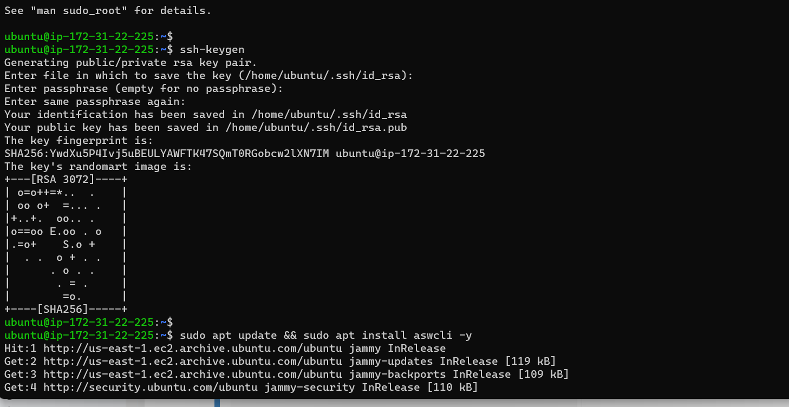
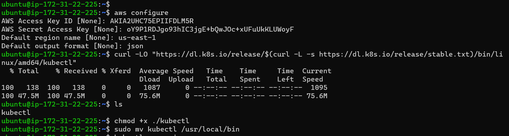
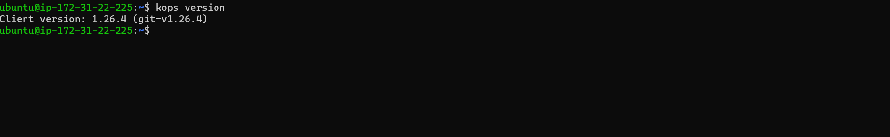

# Kubernetes-Setup-for-productions

### Clone the repository
`git clone https://github.com/devopshydclub/vprofile-project`

### Checkout to kubernetes-setup and install kubernetes-cli

` choco install minikube kubernetes-cli -y`

 
 
 ` minikube start --no-vtx-check`
 ` minikube start`
 `kubectl get node`

 ### Kops for Cluster on AWS
 (Prerequistes)
 *  Domain for Kubernetes DNS records
     e.g GoDaddy
 *  Create a linux VM and setup
     kops, kubectl, ssh key, awscli
 *  Login to AWS account and setup
    s3 bucket, IAM User for AWSCli, Routes53 hosted zone for subdomain

### Create a bucket on s3 bucket, create access key and password for AWSCli from IAM user, create hosted zoneon Route53

### Lunching EC2 instance on Unbuntu and generating key

# Updating and installing awscli
`sudo apt update && sudo apt install aswcli -y`
### Configure aws with the acess key and secrect access key generated
`aws configure`

### Installing kubectl
` curl -LO "https://dl.k8s.io/release/$(curl -L -s https://dl.k8s.io/release/stable.txt)/bin/linux/amd64/kubectl"`

### Changing permission to allow acess to kubectl

`chmod +x ./kubectl`

### Moving kubectl to allow acess from any location
`sudo mv kubectl /usr/local/bin`

### Installing Kops (Kubernates Operations)
` wget https://github.com/kubernetes/kops/releases/download/v1.26.4/kops-linux-amd64
--2023-11-28 12:35:51--  https://github.com/kubernetes/kops/releases/download/v1.26.4/kops-linux-amd64`

### Making kops executable

`chmod +x kops-linux-amd64`

### Moving kops to this folder, so that we can run command from anywhere

`sudo mv kops-linux-amd64 /usr/local/bin/kops`

.....
